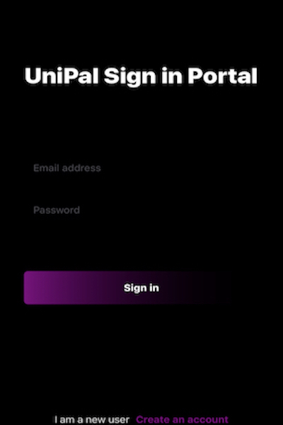
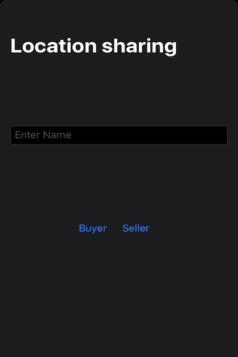
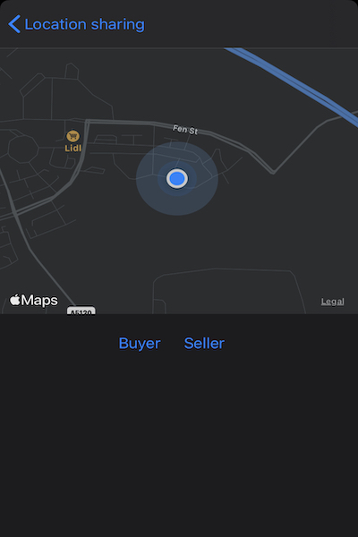

# Uni Pal
> Not yet revealing the main use of the app; but allows local users to communicate with each other.

[![Swift Version][swift-image]][swift-url]
[![Build Status][travis-image]][travis-url]  

Here are some current screenshots:

[swift-image]:https://img.shields.io/badge/swift-3.0-orange.svg
[swift-url]: https://swift.org/

[comment]: <> ( [travis-image]: https://img.shields.io/travis/dbader/node-datadog-metrics/master.svg?style=flat-square )
[comment]: <> ([travis-url]: https://travis-ci.org/dbader/node-datadog-metrics)
[comment]: <> ([codebeat-image]: https://codebeat.co/badges/c19b47ea-2f9d-45df-8458-b2d952fe9dad)
[comment]: <> ([codebeat-url]: https://codebeat.co/projects/github-com-vsouza-awesomeios-com)

